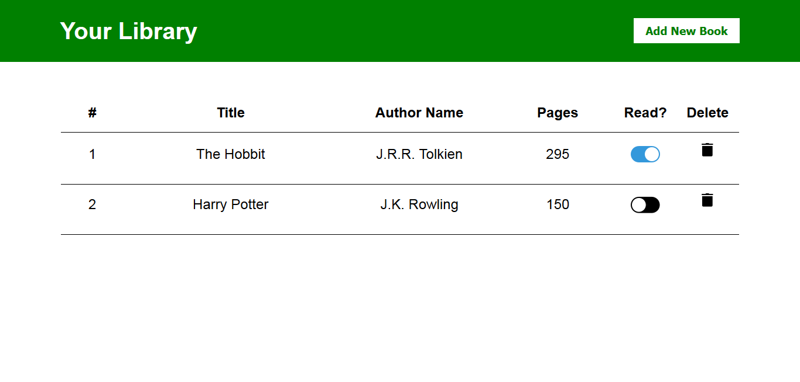
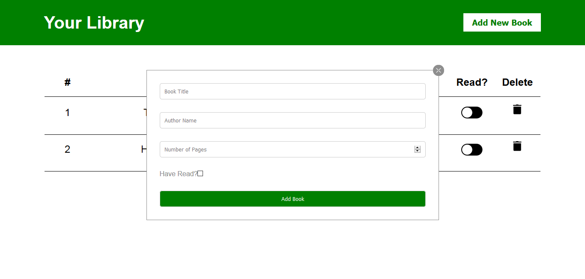

# Book Library in React JS

My solution to [The Odin Project's "Frameworks" exercise](https://www.theodinproject.com/courses/javascript/lessons/frameworks)

[Live Preview](https://araut9.github.io/book_library_react/)

## What it does

A simple web app to keep track of books you want to read and have read from your library. You can Add, Remove, and Toggle the read status of the books.

## Screenshots

1. Homepage

2. Homepage with Form to add new book to the library

## Technologies Used
- HTML
- CSS
- JavaScript
- React JS

## Contributing

Pull requests are welcome. For major changes, please open an issue first to discuss what you would like to change.

## License

This project is licensed under the MIT License - see the [LICENSE.md](LICENSE.md) file for details
